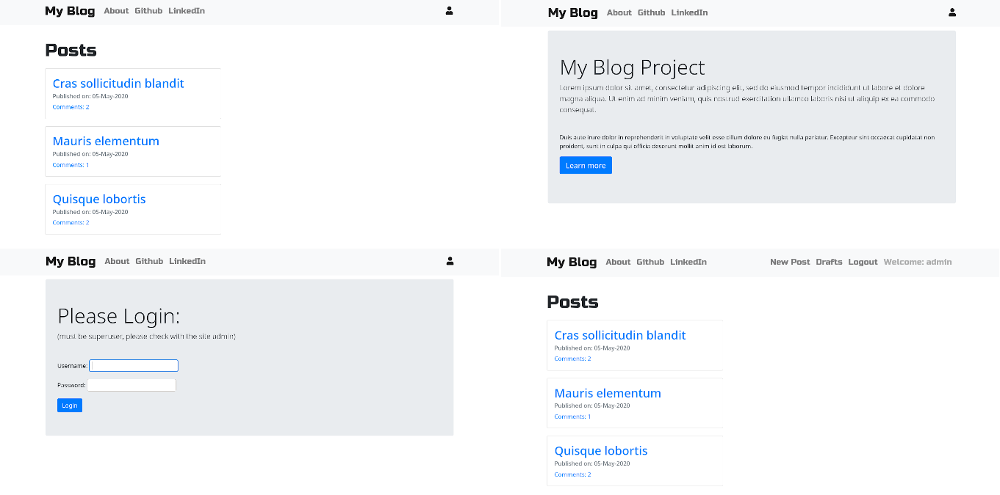
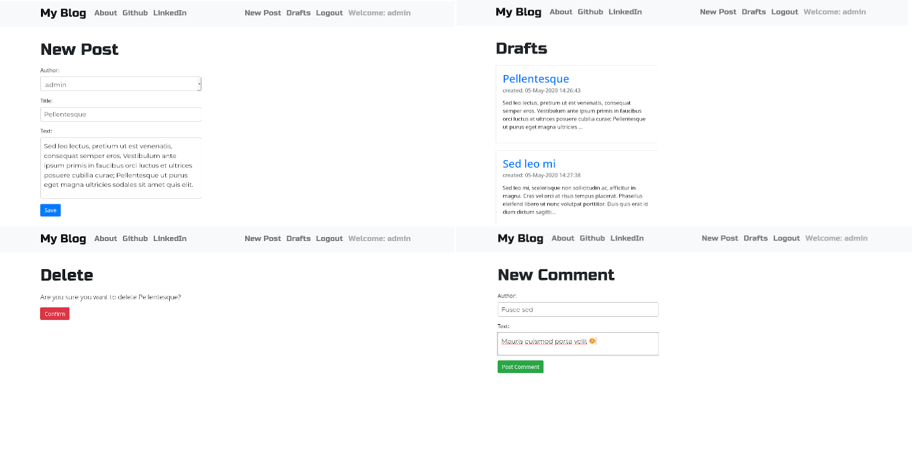

# Blog - Django Project

In this project we will be creating a *blog*. This *blog* will be a multi-user blog, rather than a personal blog.

## Environment

1. Using python `venv` for creation of virtual environments:

```
	python -m venv .venv
```

2. Create virtual environment:

```
	python -m venv /path/to/new/virtual/environment
```

3. Activate environment:

```
	source ./path/to/new/virtual/environment/bin/activate
```

4. Install `requirements.txt` file:

```
	pip install -r requirements.txt
```

5. Run server

```
	python manage.py runserver
```

## Development environment

The following technologies were used in the project:

* [Django](https://www.djangoproject.com/)
* [Bootstrap](https://getbootstrap.com/)
* [Medium Editor](https://github.com/yabwe/medium-editor)
* [Font Awesome](https://fontawesome.com/)
* [Google Fonts](https://fonts.google.com)
	* Russo One
	* Montserrat

## Results Visualization

* Home page and login user:



* Create/save/edit/delete/comment new post:




## License

[](https://opensource.org/licenses/MIT)

---

## References

* [Python and Django Full Stack Web Developer Bootcamp](https://www.udemy.com/course/python-and-django-full-stack-web-developer-bootcamp/)


